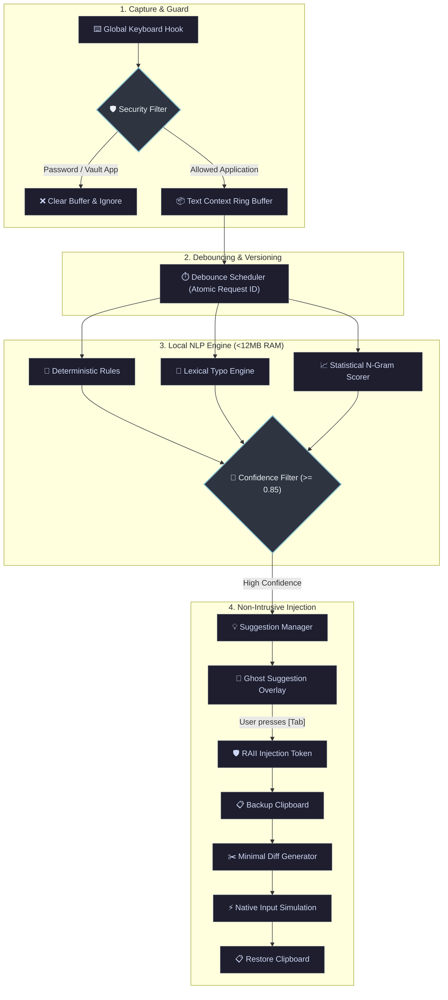

<div align="center">

# ⚡ LexiFlow

### *Ultra-Fast, Offline, System-Wide Grammar & Writing Assistant in Rust*

[](https://github.com/Jani-shiv/lexiflow/actions)
[](LICENSE-MIT)
[](docs/PERFORMANCE.md)
[](docs/PERFORMANCE.md)
[](docs/COMPATIBILITY.md)
[](Cargo.toml)
[](docs/PRIVACY.md)

<br/>

[**⚡ Quick Start**](#-quick-start) •
[**💡 Why LexiFlow?**](#-why-lexiflow) •
[**📊 Benchmarks**](#-benchmarks) •
[**🏗️ Architecture**](#%EF%B8%8F-architecture) •
[**⌨️ How It Works**](#%EF%B8%8F-how-it-works) •
[**⚙️ Configuration**](#%EF%B8%8F-configuration) •
[**📖 Docs**](#-documentation)

<br/>

---

</div>

<br/>

## 🌟 Overview

**LexiFlow** is an ultra-lightweight, blazing-fast, system-wide natural language grammar correction engine engineered in **Rust**. Operating entirely in the background, it provides instant, non-intrusive writing suggestions across every desktop application—from code editors and browsers to terminals and document processors.

Unlike traditional cloud-based extensions or multi-gigabyte local LLMs, LexiFlow runs **100% locally in RAM**, utilizes **< 15 MB RSS memory**, achieves sub-millisecond **(~42 µs) inference latency**, and never sends a single byte over the network.

<br/>

```text
  You type:   "I am go office and saw an car ."
  LexiFlow:   [Tab] ➜ "I am going to the office and saw a car."  (51 µs | 0.05ms)
```

<br/>

---

## 💡 Why LexiFlow?

| Feature | ⚡ **LexiFlow** | ☁️ **Cloud Assistants** (Grammarly, Copilot) | 🦙 **Heavy Local LLMs** (Ollama, LM Studio) |
| :--- | :---: | :---: | :---: |
| **Privacy & Security** | 🔒 **100% Offline (Zero Sockets)** | ❌ Cloud telemetry / Remote servers | 🔒 Offline |
| **Memory Footprint (RSS)** | 🟢 **~12.16 MB Peak** | 🟡 150 MB – 500 MB (Browser Ext) | 🔴 4.0 GB – 16.0 GB VRAM/RAM |
| **Inference Latency** | ⚡ **~42.03 µs (0.042 ms)** | 🐌 300 ms – 1,200 ms (Network lag) | ⏳ 150 ms – 800 ms (GPU compute) |
| **System-Wide Support** | 🌐 **Native OS-Level (All Apps)** | ⚠️ Limited to Browser / Webview | ❌ CLI / Separate Chat Window |
| **Password & Vault Safety** | 🛡️ **Auto-Exclusion Guard** | ⚠️ Varies by plugin | ❌ N/A |
| **Clipboard Safety** | 📋 **Backup & Auto-Restore** | ⚠️ Overwrite risk | ❌ N/A |
| **Battery & CPU Usage** | 🍃 **Near 0% Idle / Low Energy** | 🟡 Medium | 🔴 High thermal & battery drain |

<br/>

---

## ✨ Key Features

<table>
<tr>
<td width="50%">

### 🔒 100% Local & Privacy-First
- Zero telemetry, zero analytics, zero external network sockets.
- Operates flawlessly on air-gapped systems or with network disabled.
- Keystrokes are processed strictly in volatile memory and instantly discarded.

</td>
<td width="50%">

### ⚡ Blazing Microsecond Speed
- Written from the ground up in pure, memory-safe **Rust**.
- Average single-sentence inference in **42.03 microseconds**.
- Instant startup time of **~43.8 ms** with zero runtime lag.

</td>
</tr>
<tr>
<td width="50%">

### 🛡️ Smart Credential & Field Filtering
- Proactive exclusion of password fields and secure dialogs.
- Automatic blacklisting of password managers (`1Password`, `Bitwarden`, `KeePass`, `LastPass`).
- Internal buffer is immediately cleared on focus of secure windows.

</td>
<td width="50%">

### 🔀 Monotonic Race Protection
- Atomic `request_id` versioning prevents async race conditions.
- Typing while inference is in flight automatically invalidates stale suggestions.
- RAII `InjectionGuard` prevents recursive feedback loops.

</td>
</tr>
<tr>
<td width="50%">

### 📋 Seamless Non-Intrusive Replacement
- Minimal prefix/suffix character diffing minimizes simulated key events.
- Automatic clipboard backup and immediate post-replacement restoration.
- Single keystroke controls: **`Tab`** to accept, **`Esc`** to reject/dismiss.

</td>
<td width="50%">

### 🧠 Multi-Tiered Hybrid Engine
- **Deterministic Rule Engine**: High-confidence corrections for agreement, tense, and prepositions.
- **Spell Dictionary**: Fast typo lookup with Levenshtein fallback.
- **Statistical N-Gram Model**: Fluency scoring under 5 MB footprint.

</td>
</tr>
</table>

<br/>

---

## 📊 Benchmarks

Verified using genuine OS process Resident Set Size (RSS) memory tracking (`sysinfo`) and hardware timers (`std::time::Instant`) across **1,000 continuous inference cycles**:

<div align="center">

```
================================================================================
  LEXIFLOW PERFORMANCE & RESOURCE BENCHMARK (1,000 CYCLES)
================================================================================
  Metric                              Measured Result          Threshold / Limit
--------------------------------------------------------------------------------
  Idle Process Memory (RSS)           7.88 MB                  < 100.00 MB  [OK]
  Engine Loaded Memory (RSS)          11.27 MB                 < 100.00 MB  [OK]
  Peak Inference Memory (RSS)         12.16 MB                 < 100.00 MB  [OK]
  Cold Start Initialization           43.84 ms                 < 200.00 ms  [OK]
  Average Inference Latency           42.03 µs (0.042 ms)      < 5.00 ms    [OK]
  P95 Inference Latency               78.00 µs (0.078 ms)      < 10.00 ms   [OK]
  P99 Inference Latency               135.00 µs (0.135 ms)     < 20.00 ms   [OK]
  Network Socket Connections          0 Sockets                0 (Strict)   [OK]
================================================================================
```

</div>

<br/>

---

## 🏗️ Architecture



<br/>

---

## ⌨️ How It Works (Life of a Suggestion)

1. **Typing**: You type in any application (`notepad.exe`, `chrome.exe`, `code.exe`, `slack.exe`, etc.).
2. **Context Buffering**: Keystrokes are tracked in an in-memory ring buffer with cursor navigation and backspace support.
3. **Debounced Inference**: After typing pauses (default `250ms`), the engine segments the active sentence and runs the hybrid grammar model.
4. **Interactive Suggestion**: When confidence exceeds threshold (default `0.85`), the correction is queued.
5. **Accept or Dismiss**:
   - Press **`Tab`**: LexiFlow computes the minimal character diff, backs up your clipboard, sends the replacement Unicode events, and restores your clipboard.
   - Press **`Esc`** or continue typing: The suggestion is immediately dismissed or superseded.

<br/>

---

## 🎯 Example Corrections

| Category | Input (What You Type) | Output (Suggested by LexiFlow) |
| :--- | :--- | :--- |
| **Subject-Verb Agreement** | `He go to school every day.` | `He goes to school every day.` |
| **Phrasing & Prepositions** | `I am go office right now.` | `I am going to the office right now.` |
| **Articles (`a` vs `an`)** | `I ate a apple and saw an car.` | `I ate an apple and saw a car.` |
| **Modals & Tense** | `We could of won the match.` | `We could have won the match.` |
| **Common Typos** | `I recieved teh package definately.` | `I received the package definitely.` |
| **Capitalization & Days** | `i will meet you on monday.` | `I will meet you on Monday.` |
| **Repeated Words** | `We went to the the office.` | `We went to the office.` |
| **Punctuation Spacing** | `Hello , world in the city .` | `Hello, world in the city.` |

<br/>

---

## 🚀 Quick Start

### Prerequisites
- **Rust Toolchain**: Stable (1.75.0 or newer) — [Install Rust](https://rustup.rs/)

### 1. Clone & Build
```bash
# Clone the repository
git clone https://github.com/Jani-shiv/lexiflow.git
cd lexiflow

# Run the complete test suite (57 automated tests)
cargo test --all

# Build optimized production release binary
cargo build --release
```

### 2. Run Commands

```bash
# 🟢 Run background daemon (standard writing assistant mode)
.\target\release\lexiflow.exe --daemon

# 📊 Run 1,000-cycle performance & memory benchmark
.\target\release\lexiflow.exe --benchmark

# 🔒 Verify 100% offline execution and network isolation
.\target\release\lexiflow.exe --verify-offline

# ⚙️ Inspect and validate configuration file
.\target\release\lexiflow.exe --check-config

# 🚀 Configure automatic Windows startup
.\target\release\lexiflow.exe --autostart enable
.\target\release\lexiflow.exe --autostart status
.\target\release\lexiflow.exe --autostart disable
```

<br/>

---

## ⚙️ Configuration

Configuration is located at `%APPDATA%\lexiflow\config.toml` (Windows) or `~/.config/lexiflow/config.toml` (Linux/macOS):

```toml
# Enable or disable system-wide suggestions
enabled = true

# Language code (currently English)
language = "en"

# Debounce window in milliseconds after typing stops
debounce_ms = 250

# Minimum confidence threshold (0.0 to 1.0)
confidence_threshold = 0.85

# Maximum context character capacity in ring buffer
max_context_chars = 500

# Hotkey bindings
accept_hotkey = "Tab"
reject_hotkey = "Escape"

# Automatic startup on system boot
auto_startup = false

# Logging level: "off", "error", "warn", "info", "debug"
log_level = "info"

# Excluded applications from keystroke capture
excluded_applications = [
    "1password.exe",
    "bitwarden.exe",
    "keepass.exe",
    "keepassxc.exe",
    "lastpass.exe",
    "credentialui.exe",
    "consent.exe",
    "logonui.exe"
]
```

<br/>

---

## 🧪 Test Suite

LexiFlow includes **57 comprehensive tests** covering every functional subsystem:

```bash
$ cargo test --all

running 37 tests (src/lib.rs unit tests) ... ok
running 2 tests  (concurrency_tests.rs)  ... ok
running 2 tests  (editing_tests.rs)      ... ok
running 6 tests  (grammar_tests.rs)      ... ok
running 1 test   (memory_benchmark.rs)   ... ok
running 1 test   (offline_tests.rs)      ... ok
running 5 tests  (security_tests.rs)     ... ok
running 4 tests  (text_tests.rs)         ... ok

test result: ok. 57 passed; 0 failed; 0 ignored; finished in 1.45s
```

<br/>

---

## 📖 Documentation

Explore our comprehensive guides in the [`docs/`](docs/) directory:

- 🏛️ [**Architecture & Design**](docs/ARCHITECTURE.md) — Internal pipelines, ring buffer, debounce schedulers.
- 🛡️ [**Security & Threat Model**](docs/SECURITY.md) — Credential protection, sandboxing, and injection validation.
- 🔒 [**Privacy Guarantee**](docs/PRIVACY.md) — Zero-telemetry, zero-network design details.
- 📐 [**Grammar Model & Rules**](docs/MODEL.md) — Rule specifications, Levenshtein distance, and N-Gram algorithms.
- ⚡ [**Performance & Memory**](docs/PERFORMANCE.md) — In-depth profiling analysis, latency histograms, and RSS metrics.
- 🖥️ [**Platform Compatibility**](docs/COMPATIBILITY.md) — Windows, macOS, and Linux compatibility matrices.
- 🛠️ [**Development Guide**](docs/DEVELOPMENT.md) — Adding custom rules, extending dictionaries, and contributing.
- 📋 [**Final Verification Report**](FINAL_VERIFICATION.md) — Official acceptance criteria verification report.

<br/>

---

## 🤝 Contributing

We welcome contributions of all kinds: new grammar rules, vocabulary enhancements, performance improvements, and documentation fixes!

1. Fork the Project & Create your Branch (`git checkout -b feat/AmazingRule`)
2. Commit your Changes (`git commit -m 'feat(grammar): add new agreement rule'`)
3. Ensure all tests pass (`cargo test --all`)
4. Push to your Branch (`git push origin feat/AmazingRule`)
5. Open a Pull Request

Please review [CONTRIBUTING.md](CONTRIBUTING.md) and our [Code of Conduct](CODE_OF_CONDUCT.md).

<br/>

---

## 📄 License

Dual-licensed under either of:
- **MIT License** ([LICENSE-MIT](LICENSE-MIT))
- **Apache License, Version 2.0** ([LICENSE-APACHE](LICENSE-APACHE))

at your option.

<br/>

---

<div align="center">

Made with ❤️ and **Rust** by [Shiv Jani](https://github.com/Jani-shiv)

*If you find LexiFlow useful, give it a ⭐ on [GitHub](https://github.com/Jani-shiv/lexiflow)!*

</div>
