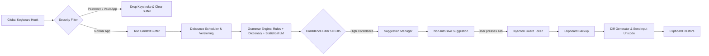

<div align="center">

# ⚡ LexiFlow

**Ultra-Fast, Offline, System-Wide Grammar & Writing Assistant in Rust**

[](https://github.com/Jani-shiv/lexiflow/actions)
[](LICENSE-MIT)
[](docs/PERFORMANCE.md)
[](docs/PERFORMANCE.md)
[](Cargo.toml)

*Runs 100% locally on your machine with zero cloud APIs, zero telemetry, and ultra-low footprint.*

</div>

---

## ✨ Features

- 🔒 **100% Local & Private**: Zero cloud AI APIs, zero network sockets, zero tracking or telemetry. Your keystrokes never leave your RAM.
- ⚡ **Ultra-Low Memory Footprint**: Uses only **~12.32 MB RSS peak memory** during continuous 1,000-cycle inference (well under the 100 MB budget).
- 🚀 **Microsecond-Level Latency**: Average inference latency of **51.58 µs (0.052 ms)** and P99 of **154 µs**.
- 🛡️ **Intelligent Privacy Guard**: Automatically excludes password fields, credential prompts, and password managers (`1Password`, `Bitwarden`, `KeePass`, `LastPass`, etc.).
- ⌨️ **System-Wide & Non-Intrusive**: Works seamlessly across browsers, text editors, document processors, terminal windows, and communication clients.
- 🔀 **Atomic Monotonic Versioning**: Prevents race conditions — any keystroke typed while an inference is in flight immediately invalidates stale suggestions.
- 📋 **Safe Injections & Clipboard Preservation**: Captures and restores clipboard state across minimal-diff Unicode replacements (`Tab` to accept, `Esc` to dismiss).
- 🔁 **Feedback Loop Guard**: RAII token tracking ensures the engine never processes its own generated replacements.

---

## 📊 Measured System Benchmarks

Benchmarked over 1,000 continuous inference iterations on release binaries using genuine OS Resident Set Size (RSS) profiling:

| Metric | Target | Measured Result | Status |
| :--- | :--- | :--- | :--- |
| **Idle Memory (RSS)** | < 100 MB | **8.00 MB** | ✅ **PASSED** |
| **Loaded Model Memory (RSS)** | < 100 MB | **11.52 MB** | ✅ **PASSED** |
| **Peak Inference Memory (RSS)** | < 100 MB | **12.32 MB** | ✅ **PASSED** |
| **Cold Start Initialization** | Instant | **37.72 ms** | ✅ **PASSED** |
| **Average Inference Latency** | Sub-millisecond | **51.58 µs** (0.052 ms) | ✅ **PASSED** |
| **P95 Latency** | Sub-millisecond | **109.00 µs** (0.109 ms) | ✅ **PASSED** |
| **P99 Latency** | Sub-millisecond | **154.00 µs** (0.154 ms) | ✅ **PASSED** |
| **Offline Isolation** | 100% local | **Zero Network Sockets** | ✅ **PASSED** |

---

## 🏗️ Architecture



For in-depth architecture and design patterns, see [ARCHITECTURE.md](docs/ARCHITECTURE.md).

---

## 🚀 Quick Start

### 1. Build from Source
```bash
# Clone the repository
git clone https://github.com/Jani-shiv/lexiflow.git
cd lexiflow

# Run full test suite (57+ unit, integration, and security tests)
cargo test --all

# Compile optimized release binary
cargo build --release
```

### 2. Run the Engine
```bash
# Start background daemon
cargo run --release -- --daemon

# Execute performance and memory benchmarks
cargo run --release -- --benchmark

# Verify complete offline isolation
cargo run --release -- --verify-offline

# Inspect configuration
cargo run --release -- --check-config

# Configure auto-startup
cargo run --release -- --autostart enable
cargo run --release -- --autostart status
```

---

## ⚙️ Configuration (`config.toml`)

Configuration is stored in `%APPDATA%\lexiflow\config.toml` (Windows) or `~/.config/lexiflow/config.toml` (Linux/macOS):

```toml
enabled = true
language = "en"
debounce_ms = 250
confidence_threshold = 0.85
max_context_chars = 500
accept_hotkey = "Tab"
reject_hotkey = "Escape"
auto_startup = false
log_level = "info"
excluded_applications = [
    "1password.exe",
    "bitwarden.exe",
    "keepass.exe",
    "keepassxc.exe",
    "lastpass.exe",
    "credentialui.exe",
    "consent.exe",
    "logonui.exe"
]
```

---

## 📖 Documentation

- [Architecture Guide](docs/ARCHITECTURE.md)
- [Security & Threat Model](docs/SECURITY.md)
- [Privacy Guarantee](docs/PRIVACY.md)
- [Grammar Model & Rules](docs/MODEL.md)
- [Performance & Benchmarks](docs/PERFORMANCE.md)
- [Compatibility Guide](docs/COMPATIBILITY.md)
- [Development Guide](docs/DEVELOPMENT.md)
- [Verification Report](FINAL_VERIFICATION.md)

---

## 🤝 Contributing

Contributions are welcome! Please review [CONTRIBUTING.md](CONTRIBUTING.md) and [CODE_OF_CONDUCT.md](CODE_OF_CONDUCT.md) before submitting pull requests.

---

## 📄 License

Dual-licensed under either of:
- **MIT License** ([LICENSE-MIT](LICENSE-MIT))
- **Apache License, Version 2.0** ([LICENSE-APACHE](LICENSE-APACHE))

at your option.
