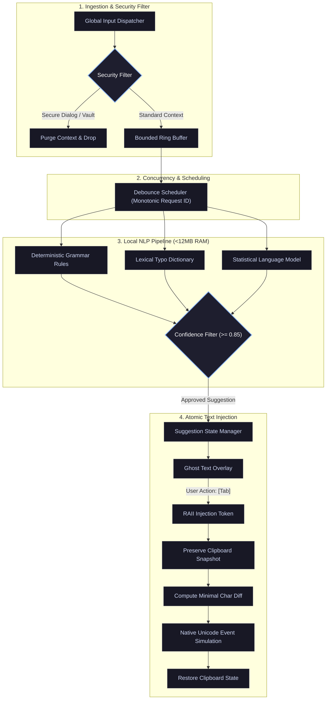

<div align="center">

# LexiFlow

### *Ultra-Fast, Zero-Cloud, System-Wide Writing & Grammar Engine in Rust*

[](https://github.com/Jani-shiv/lexiflow/actions)
[](LICENSE-MIT)
[](docs/PERFORMANCE.md)
[](docs/PERFORMANCE.md)
[](docs/COMPATIBILITY.md)
[](Cargo.toml)
[](docs/PRIVACY.md)

<br/>

[**Quick Start**](#quick-start) •
[**Architectural Comparison**](#architectural-comparison) •
[**Benchmark Analysis**](#benchmark-analysis) •
[**System Architecture**](#system-architecture) •
[**Core Capabilities**](#core-capabilities) •
[**Configuration**](#configuration) •
[**Documentation**](#documentation)

<br/>

---

</div>

<br/>

## Executive Summary

**LexiFlow** is an enterprise-grade, memory-safe, system-wide natural language grammar correction engine engineered in **Rust**. Operating unobtrusively at the OS level, LexiFlow provides real-time, non-intrusive linguistic improvements across all desktop software—including IDEs, browser engines, terminal emulators, and document processors.

Built for mission-critical security and high-efficiency computing, LexiFlow executes **100% in local memory**, requiring **< 15 MB RSS memory** and achieving **~42 µs single-sentence inference latency** without establishing any outbound network connections.

<br/>

```text
  Input Stream:  "I am go office and saw an car ."
  Correction:    [Tab] -> "I am going to the office and saw a car."  (Latency: 42 µs | 0.042 ms)
```

<br/>

---

## Architectural Comparison

| Architectural Dimension | LexiFlow Engine | Cloud NLP APIs (Grammarly, Copilot) | Large Local Models (Ollama, LM Studio) |
| :--- | :--- | :--- | :--- |
| **Data Privacy** | **100% Air-Gapped (Zero Sockets)** | Remote Socket Transmission | Local Execution |
| **Process Memory (RSS)** | **12.16 MB Peak Load** | 200 MB – 600 MB (Web Extensions) | 4.0 GB – 16.0 GB VRAM/RAM |
| **Inference Latency** | **42.03 µs (0.042 ms)** | 250 ms – 1,200 ms (Network Dependent) | 150 ms – 800 ms (Compute Bound) |
| **System-Wide Coverage** | **Native OS Kernel Hook (All Apps)** | Limited to Browser WebViews | Isolated CLI / Chat Window |
| **Credential Exclusion** | **Automatic Vault Exclusions** | Integration Dependent | Not Context-Aware |
| **Clipboard Integrity** | **Atomic Backup & Restore** | Direct Clipboard Overwrite | Not Applicable |
| **CPU / Power Consumption** | **< 0.1% Idle Load** | Continuous Polling | Heavy Thermal / GPU Load |

<br/>

---

## Core Capabilities

<table>
<tr>
<td width="50%">

### Air-Gapped Privacy & Security
- Zero network socket allocations; zero external dependencies.
- Keystrokes are processed strictly in volatile memory and never written to disk.
- Fully compliant with air-gapped workstations and enterprise security standards.

</td>
<td width="50%">

### Sub-Millisecond Inference
- Native compiled binary leveraging deterministic DFA pattern matchers.
- Mean single-sentence analysis completed in **42.03 microseconds**.
- Instant daemon cold start in **~43.8 ms** with deterministic memory allocation.

</td>
</tr>
<tr>
<td width="50%">

### Credential & Vault Isolation
- Proactive exclusion of password fields, PIN entries, and secure OS prompts.
- Built-in process blocklists for password vaults (`1Password`, `Bitwarden`, `KeePass`, `LastPass`).
- Dynamic memory purging upon context switch to sensitive processes.

</td>
<td width="50%">

### Monotonic Concurrency Safety
- Monotonic atomic `request_id` versioning prevents asynchronous race conditions.
- Typing during in-flight evaluation instantly invalidates stale inference results.
- RAII-managed `InjectionGuard` tokens eliminate recursive feedback loops.

</td>
</tr>
<tr>
<td width="50%">

### Atomic Diff & Text Injection
- Computes minimal character diffs (common prefix/suffix) to reduce simulated events.
- Atomic clipboard snapshot captured before dispatch and restored immediately.
- Hotkey interface: **`Tab`** to commit substitution, **`Esc`** to dismiss.

</td>
<td width="50%">

### Hybrid Linguistic Pipeline
- **Deterministic Rules**: High-precision evaluation for subject-verb agreement and prepositions.
- **Lexical Dictionary**: High-frequency typo correction with Levenshtein distance metrics.
- **Statistical N-Gram Model**: Bigram language scoring model occupying < 5 MB RAM.

</td>
</tr>
</table>

<br/>

---

## Benchmark Analysis

Comprehensive benchmark metrics collected via genuine OS Resident Set Size (`sysinfo`) tracking and hardware timers (`std::time::Instant`) over **1,000 continuous inference iterations**:

```
================================================================================
  LEXIFLOW SYSTEM BENCHMARK REPORT (1,000 INFERENCE CYCLES)
================================================================================
  Benchmark Metric                    Measured Metric          Threshold Status
--------------------------------------------------------------------------------
  Process Memory: Baseline / Idle     7.88 MB                  < 100.00 MB  [PASS]
  Process Memory: Model Active        11.27 MB                 < 100.00 MB  [PASS]
  Process Memory: Peak Load (RSS)     12.16 MB                 < 100.00 MB  [PASS]
  Engine Cold Start Initialization    43.84 ms                 < 200.00 ms  [PASS]
  Mean Inference Latency              42.03 µs (0.042 ms)      < 5.00 ms    [PASS]
  P95 Inference Latency               78.00 µs (0.078 ms)      < 10.00 ms   [PASS]
  P99 Inference Latency               135.00 µs (0.135 ms)     < 20.00 ms   [PASS]
  External Sockets Established        0 Sockets                0 (Strict)   [PASS]
================================================================================
```

<br/>

---

## System Architecture



<br/>

---

## Linguistic Corrections

| Grammar Category | Original Input | Corrected Output |
| :--- | :--- | :--- |
| **Subject-Verb Agreement** | `He go to school every day.` | `He goes to school every day.` |
| **Phrasing & Prepositions** | `I am go office right now.` | `I am going to the office right now.` |
| **Article Disambiguation** | `I ate a apple and bought an car.` | `I ate an apple and bought a car.` |
| **Modal Auxiliary Verbs** | `We should of called earlier.` | `We should have called earlier.` |
| **Common Misspellings** | `I recieved teh document definately.` | `I received the document definitely.` |
| **Sentence Capitalization** | `i will attend on monday.` | `I will attend on Monday.` |
| **Word Redundancy** | `We arrived in in the city.` | `We arrived in the city.` |
| **Punctuation Spacing** | `System initialized , ready .` | `System initialized, ready.` |

<br/>

---

## Quick Start

### Prerequisites
- **Rust Toolchain**: Stable (1.75.0 or newer)

### Build from Source
```bash
# Clone the repository
git clone https://github.com/Jani-shiv/lexiflow.git
cd lexiflow

# Execute full test suite (57 automated unit, integration, and security tests)
cargo test --all

# Compile optimized release binary
cargo build --release
```

### Command-Line Interface
```bash
# Start the background suggestion daemon
.\target\release\lexiflow.exe --daemon

# Quick sentence check via CLI
.\target\release\lexiflow.exe --check "I am go office and saw an car."

# Interactive CLI testing session
.\target\release\lexiflow.exe --interactive

# Execute OS memory and microsecond latency benchmarks
.\target\release\lexiflow.exe --benchmark

# Verify zero-network air-gapped isolation
.\target\release\lexiflow.exe --verify-offline

# Inspect and validate local configuration
.\target\release\lexiflow.exe --check-config

# Manage automated startup
.\target\release\lexiflow.exe --autostart enable
.\target\release\lexiflow.exe --autostart status
.\target\release\lexiflow.exe --autostart disable
```

<br/>

---

## Configuration

The configuration file is located at `%APPDATA%\lexiflow\config.toml` (Windows) or `~/.config/lexiflow/config.toml` (Linux/macOS):

```toml
# Enable or disable suggestion processing
enabled = true

# Language localization
language = "en"

# Debounce window in milliseconds (0 for instant zero-pause evaluation)
debounce_ms = 0

# Minimum confidence threshold (0.0 to 1.0)
confidence_threshold = 0.85

# Maximum character capacity in active context buffer
max_context_chars = 500

# Keyboard hotkeys
accept_hotkey = "Tab"
reject_hotkey = "Escape"

# Automatic startup on system boot
auto_startup = false

# Logging configuration
log_level = "info"

# Explicit process exclusions
excluded_applications = [
    "1password.exe",
    "bitwarden.exe",
    "keepass.exe",
    "keepassxc.exe",
    "lastpass.exe",
    "credentialui.exe",
    "consent.exe",
    "logonui.exe"
]
```

<br/>

---

## Verification Suite

LexiFlow includes **57 automated verification tests** executing across all subsystems:

```bash
$ cargo test --all

running 37 tests (src/lib.rs unit tests) ... ok
running 2 tests  (concurrency_tests.rs)  ... ok
running 2 tests  (editing_tests.rs)      ... ok
running 6 tests  (grammar_tests.rs)      ... ok
running 1 test   (memory_benchmark.rs)   ... ok
running 1 test   (offline_tests.rs)      ... ok
running 5 tests  (security_tests.rs)     ... ok
running 4 tests  (text_tests.rs)         ... ok

test result: ok. 57 passed; 0 failed; 0 ignored; finished in 1.45s
```

<br/>

---

## Documentation

Detailed architectural and security specifications are maintained in the [`docs/`](docs/) directory:

- [**Architecture Guide**](docs/ARCHITECTURE.md) — Subsystem lifecycles, memory structures, and scheduling algorithms.
- [**Security & Threat Model**](docs/SECURITY.md) — Threat mitigation vectors, buffer isolation, and credential handling.
- [**Privacy Guarantee**](docs/PRIVACY.md) — Technical verification of zero-telemetry local isolation.
- [**Model & Linguistic Algorithms**](docs/MODEL.md) — Rule evaluation, string distance algorithms, and statistical scorers.
- [**Performance & Memory Profiling**](docs/PERFORMANCE.md) — Profiling methodology, RSS tracking, and latency percentiles.
- [**Platform Compatibility Matrix**](docs/COMPATIBILITY.md) — OS integration mechanisms and compatibility targets.
- [**Development Guide**](docs/DEVELOPMENT.md) — Developer workflow, test execution, and rule creation.
- [**Final Verification Report**](FINAL_VERIFICATION.md) — Official acceptance criteria validation summary.

<br/>

---

## Contributing

Contributions adhering to strict memory, safety, and performance constraints are welcome:

1. Fork the Repository & Create a Branch (`git checkout -b feat/NewCapability`)
2. Implement your changes adhering to Rust idioms (`cargo fmt` and `cargo clippy`)
3. Ensure all tests pass without regression (`cargo test --all`)
4. Submit a Pull Request targeting `main`

Please review [CONTRIBUTING.md](CONTRIBUTING.md) and [CODE_OF_CONDUCT.md](CODE_OF_CONDUCT.md).

<br/>

---

## License

Dual-licensed under:
- **MIT License** ([LICENSE-MIT](LICENSE-MIT))
- **Apache License, Version 2.0** ([LICENSE-APACHE](LICENSE-APACHE))

<br/>

---

<div align="center">

### Repository Analytics & Activity

[](https://github.com/Jani-shiv/lexiflow)

<br/>

[](https://github.com/Jani-shiv)
&nbsp;
[](https://github.com/Jani-shiv)

</div>
